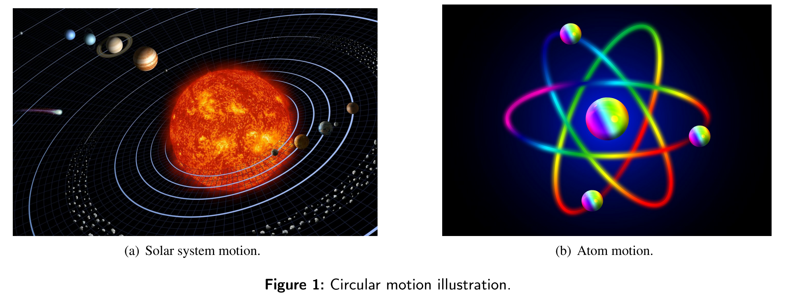
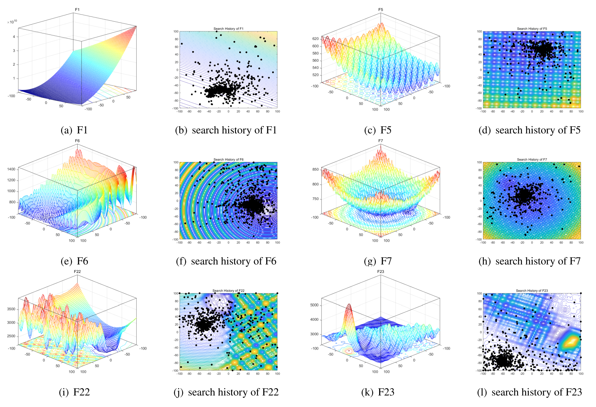
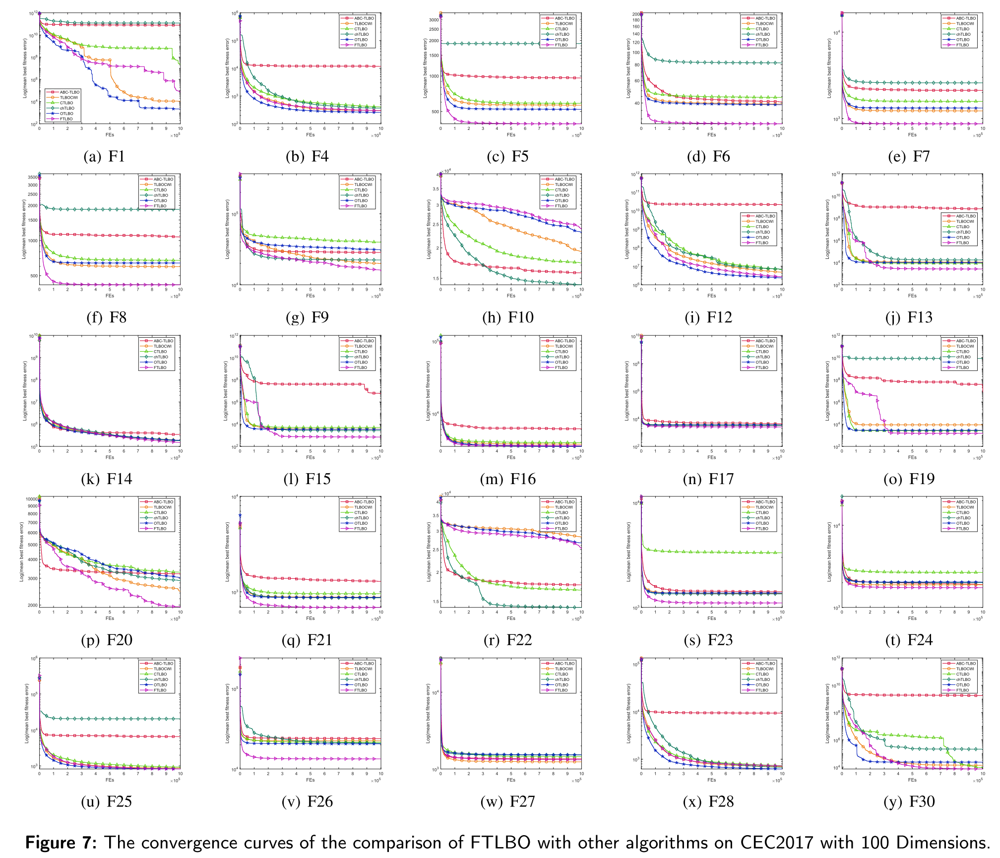
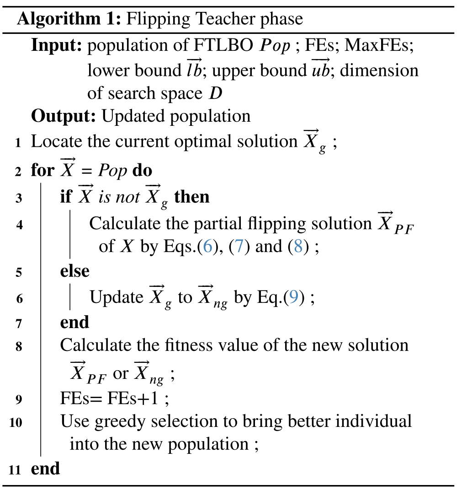
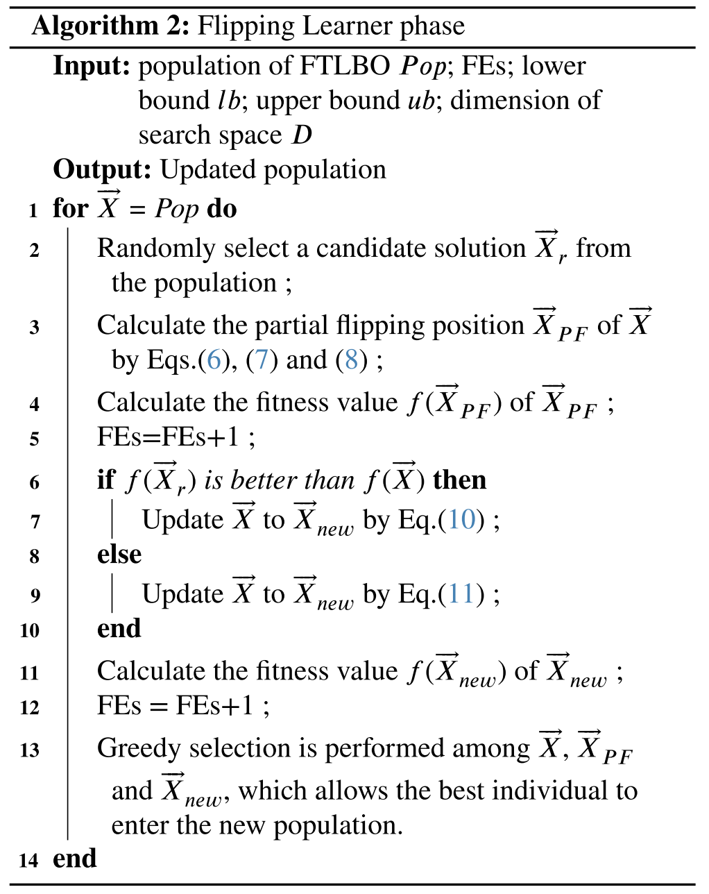

# FTLBO
FTLBO: A Novel Flipping-Teaching-Learning-Based Optimization Algorithm for Numerical Global Optimization with Applications

## Introduction
Inspired by circular motion, this paper proposes a flipping mechanism population search approach, and then an improved teaching-learning-based optimization algorithm based the flipping search approach (FTLBO) is designed. The innovations of FTLBO consists mainly of four parts: First, in the teacher phase, the updating mechanism of teacher guidance is replaced by a flipping mechanism, which enables a more comprehensive exploitation search ability to accelerate the population convergence; Second, a novel updating method is adopted to help local optimal solutions escape from local optimal regions; Third, the FTLBO algorithm widens communication channels between learners through the flipping mechanism and enhance the population exploration search ability; Finally, in learner phase, FTLBO uses a bidirectional learning mechanism to expand the promising search spaces for individuals. In order to verify the global performance of FTLBO algorithm, the proposed optimizer is compared with 10 efficient meta-heuristic methods on the CEC2017 test suite with 30 functions. Experimental and statistical results based on the Friedman test and the Wilcoxon signed-rank test confirmed the effectiveness and efficient of FTLBO algorithm. Moreover, to verify the ability to solve real-world problems, FTLBO is applied on two types of real-world optimization problems: the power scheduling problems in a smart home and the multi-thresholding image segmentation problems. Simulation results further demonstrated that the FTLBO algorithm can provide a promising better performance in terms of solution quality. The source code of FTLBO algorithm is publicly available at  https://github.com/tsingke/FTLBO.

## Inspired Principle

## Search Performance

## Algorithm pseudocode

 ## Acknowledgements
 
This work is supported by Natural Science Foundation of Shandong Province (62006144), Major Fundamental Research Project of Shandong Province (No. ZR2019ZD03), and Taishan Scholar Project of Shandong Province (No. ts20190924).

**Thank you for taking the time to review our paper and we would like to express our sincere gratitude to you!**

**Best Regards!**

